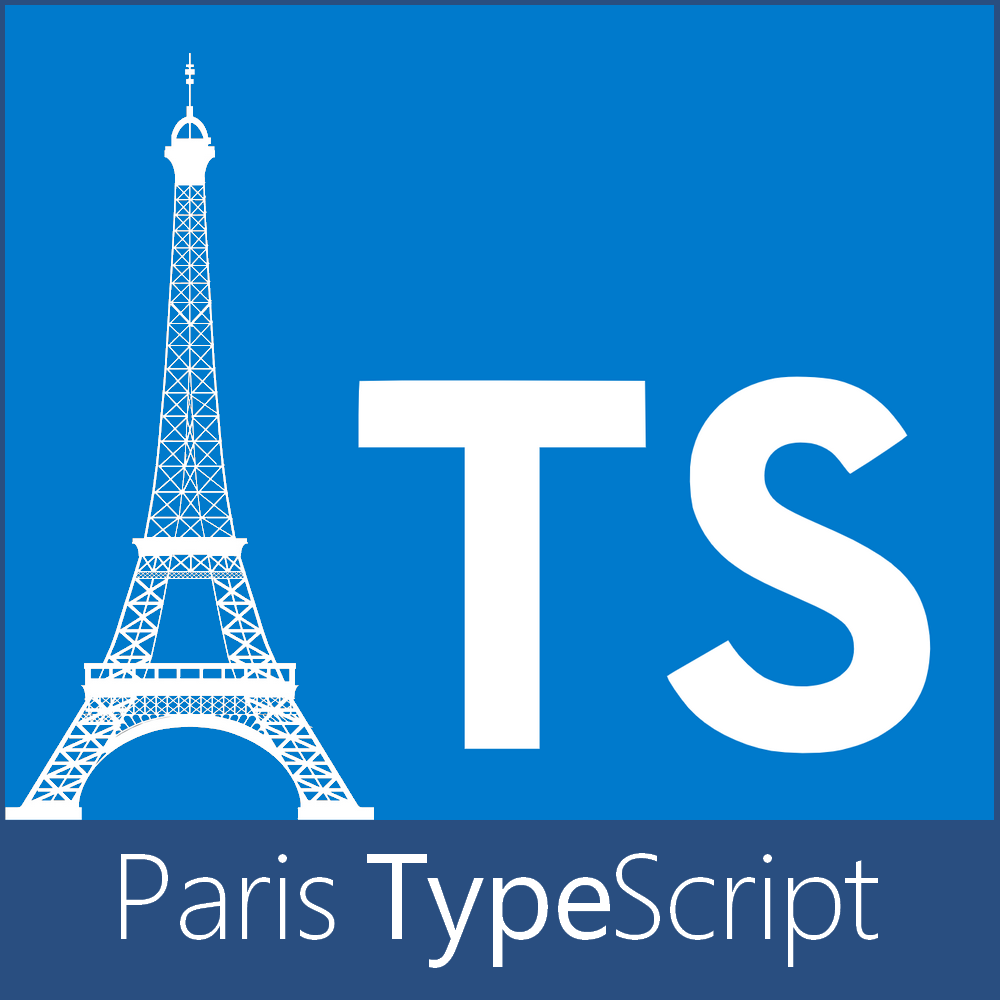
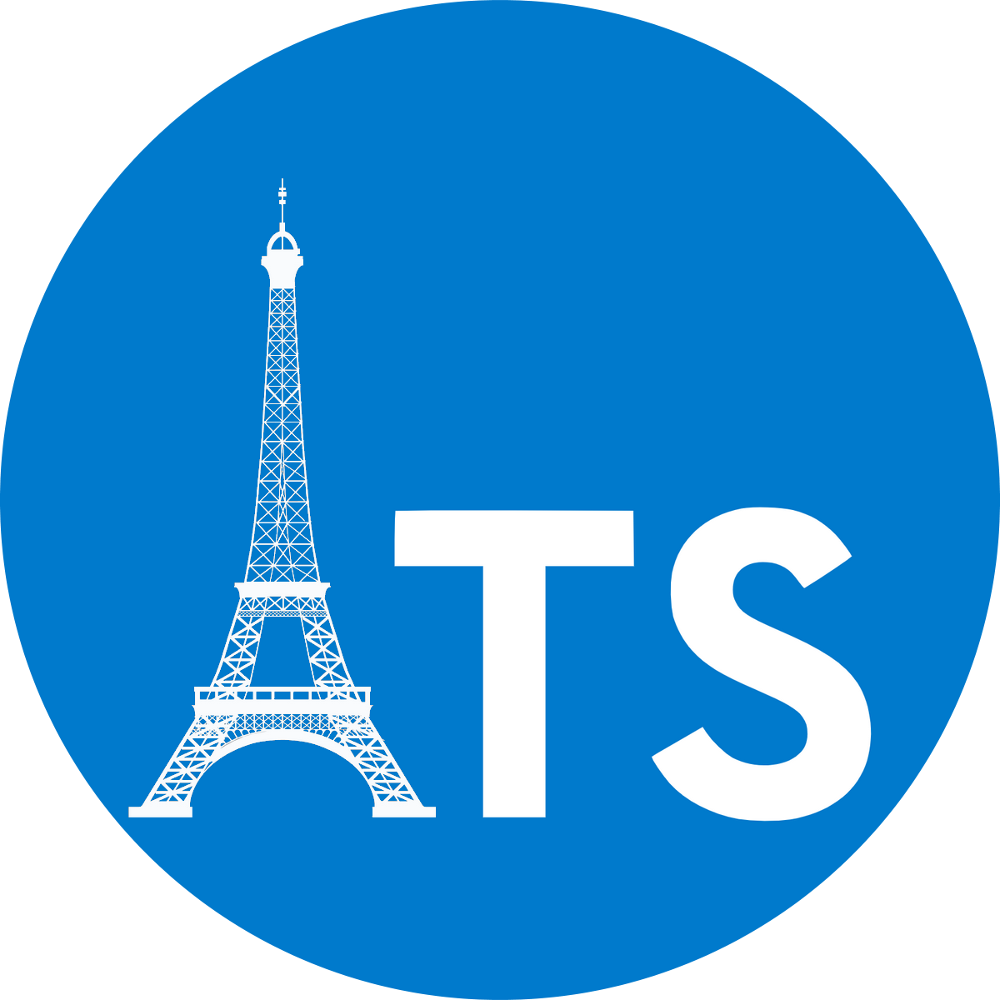

# Paris TypeScript Website

## Links
- [Website](https://typescript.paris)
- [Meetup](https://www.meetup.com/Paris-Typescript/)
- [Twitter](https://twitter.com/ParisTypeScript)
- [Slack](https://slackin.typescript-paris.now.sh/)
- [Linkedin](https://www.linkedin.com/company/paris-typescript/)
- [Youtube](https://www.youtube.com/channel/UCoV7eLpMyIW1FSXwjk3nqIQ)
- [Github](https://github.com/ParisTypeScript)

We are friends with:
- [Best of Web](https://www.bestofweb.paris/)
- [dotjs](https://www.dotjs.io/)
- [Voxxed Microservices](https://voxxeddays.com/microservices/)
- [Paris.js](https://parisjs.org/)
- [Deno Paris](https://deno.paris)
- [Nest.js Paris](https://www.meetup.com/fr-FR/NestJS-Paris-Meetup/)
- ...

## Brand

Raw sources [here](img/)

Logo

Logo no text

Round Logo

Round Logo negative

## Code of Conduct

[CoC](CODE_OF_CONDUCT.md)

## Licence

[MIT](LICENCE)

## Logo

Effeil tower image by [http://buysellgraphic.com/](https://all-free-download.com/free-vector/download/eiffel-tower_312253.html)
